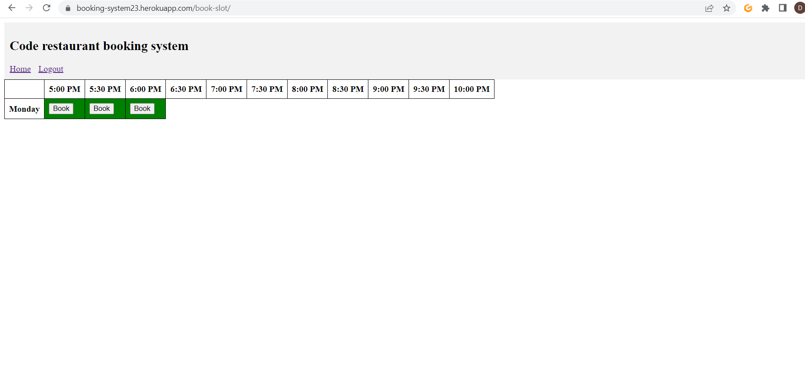

# Booking system
OK obviously I am aware I have failed this. No excuses other than timekeeping, I only finished college at the start of the month and by the time I got through with the content I only had 3 evenings to get this done. I will talk through my thinking here and continue on with this and hope I have the chance to resubmit.\n

<a href="https://booking-system23.herokuapp.com/book-slot/">Here is a link to what is there</a>

## Attempt
I started with getting the deployment done like in one of the walkthroughs and managed to get the login functionality working with messages to tell you that you have been successful etc. The cells will tell you to log in and will not show the book button if you are not logged in. I have only implemented 3 cells in this table but they were only a copy/paste to fill the table and I wanted to get the code functioning first so I didnt have to change it everywhere. Here I wanted to click the button, get a message saying you have booked that slot and the cell to turn red with the button changing to cancel and they would toggle when pressed. This was my basic MVP that a server in a restaurant could book people into slots and funtionality could be given to other users after. I have not got that function working and am having problems with cloudinary which could be the cause.

### Problem code
DATABASES = {
    'default': {
        'ENGINE': 'django.db.backends.sqlite3',
        'NAME': BASE_DIR / 'db.sqlite3',
    }
}
 
DATABASES = {
    'default': dj_database_url.parse(os.environ.get('DATABASE_URL'))
}
  
When the first statement above is commented out and second inserted like in the tutorials my code breaks completely. I have the key in the env.py file but i get errors whenever I try to run the server, make migrations ect. It will run in heroku with setting on which I tried to use and debugging while pushing to a deployment server wasnt fun. Although it runs on heroku some features broke with it. The allauth login/signup pages just stopped loading up with this set up. I havnt used tutor support yet and it is too late too before this project is due but i will be pointing towards this as an explination for advice. Any other feedback to help would be greatly appreciated but I am going to keep going at these even if it is in another repo for the time being.
